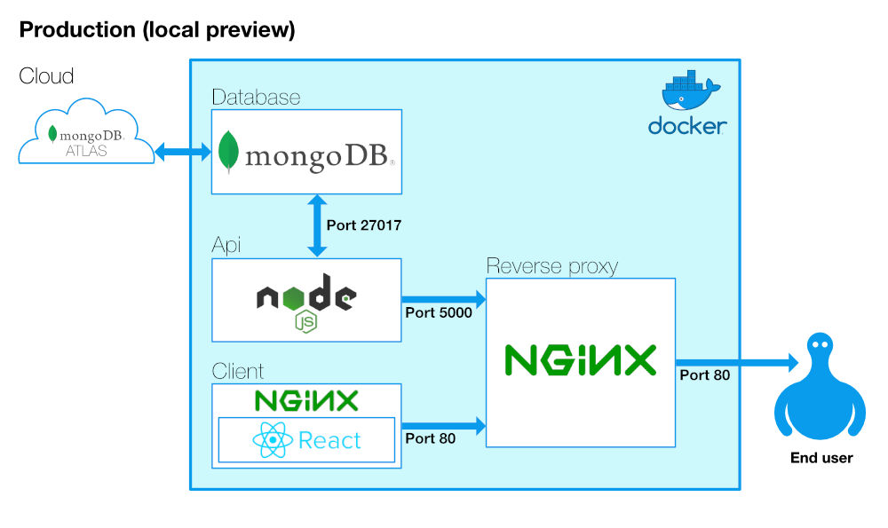

## MERN Stack

This is an accelerator fro a MERN (Mongo, Express, React, Node) Stack.
It may be run in development or production mode. It is written entirely in TypeScript and is a bare bones implementation. It does include Vittest for testing both client-side and server-side code.

It allows a full stack application to be rapidly developed with an database, API and UI.

With a bit more setup the application may be deployed to AWS Elastic Beanstalk via a GitHub Actions pipeline – see guides below.

### Requirements
Minimum requirements:
- **GitHub** account (free tier available): [https://github.com/](https://github.com/)
- **DockerHub** account (free tier available): [https://hub.docker.com/](https://hub.docker.com/)
- **Node** [https://nodejs.org/en/download](https://nodejs.org/en/download) or for more control over which version of Node to run, **Node Version Manager(nvm)** for Windows: [https://github.com/coreybutler/nvm-windows](https://github.com/coreybutler/nvm-windows) or for Mac (using Homebrew): [https://formulae.brew.sh/formula/nvm](https://formulae.brew.sh/formula/nvm)
- **The Docker Desktop App** [https://www.docker.com/products/docker-desktop/](https://www.docker.com/products/docker-desktop/)
- **Mongodb Compass** A GUI for editing local and remote Mongodb databases [https://www.mongodb.com/try/download/compass](https://www.mongodb.com/try/download/compass). This will be needed to add the initial database 'testbase' to the containerised Mongodb instance.

To run in production mode or release to production will require the following:
- **Mongo Atlas** account (a cloud based MongoDB SAS platform with a free tier) [https://www.mongodb.com/atlas](https://www.mongodb.com/atlas)
- **Amazon Web Services (AWS)** account [https://aws.amazon.com/?nc2=h_lg](https://aws.amazon.com/?nc2=h_lg)


### GitHub Secrets

The following 'Secrets' will require adding to the GitHub repo:

    DOCKER_USERNAME
    DOCKER_PASSWORD
    AWS_ACCESS_KEY
    AWS_SECRET_KEY

If not deploying to AWS, in the file '.github/workflows/deploy.yml', comment out or delete the final selection beginning ``` - name: Deploy to EB``` as this will fail if correct AWS Keys are not supplied

Details of how to obtain the correct values are described below in the relevant sections.

To add the Secrets, in the project’s Git repository, go to Settings -> Secrets and variables -> actions. Click the 'New repository secret' button and add the key value pairs. Make a record of them as, once set, they are no longer accessible and don't save the record in the repository. They are safe to use in public repositories as they cannot be accessed once set.

## Development mode

### Setup Development
Install [Mongo Compass](https://www.mongodb.com/products/compass) and add a new database called 'testbase' with a collection called 'products'. The app will add items withe the following shape:

```
{
  "name": "test",
  "price": 22
}
```

### Database initialisation – development
run:
```
$ yarn dev:build
```
Open the MongoDB Compass application, from the Connect menu choose ‘New window’ to open the connection in a new window and click the ‘New connection’ button. 

In the URI field type: ```mongodb://localhost:27017 ```. 

Drop down the ‘Advanced Connection Options’ menu, select ‘Authentication’ and choose ‘Authentication Method -> Username/Password’. Username and password are both 'root'. This is set in the ```docker-compose.dev.yml``` file and may be changed here, if you wish: 

```yaml
services:
# MogoDb Services
# -- lines ommited for brevity --
    environment:
      MONGO_INITDB_ROOT_USERNAME: root
      MONGO_INITDB_ROOT_PASSWORD: root
```
In the Compass window, from the side menu click the **+** icon (see below).
```
{} My Queries
🗄️  Databases  🔄 +
```
Call the database **‘testbase’** and the collection **‘products’**. 

Click on the ‘Create database‘ button.


### Run Development
run:
```bash
$ yarn dev:up 
```
or, to rebuild the containers, if any changes have been made to Docker code, run:
```bash
$ yarn dev:up: build 
```

In development mode there is live updating of both the client and server code with the client-side React app live reloading on change.

There is a local version of Mongo which runs in a Docker container and has a Docker volume which persists data between restarts.

This should run with no additional setup as database, api and front-end are all self contained.

This builds the following:


## Production mode

running ```prod:up:build``` will create a local build which accesses the production cloud database and allows for testing with real data. NB anyone accessing the Mongodb Atlas database will need to be added to the whitelisted IP addresses under ‘Security -> Database Access’
### Database initialisation – production
If you do not already have an account with [MongoDb](https://cloud.mongodb.com/) set one up – free tiers are available.

Go to the ‘MongoDB Atlas’ portal and create a new project, name it anything you wish.

Click the ‘CONNECT’ button and under ‘Connect to your application’ click ‘Drivers’, choose ‘Node.js 5.5 or later’ and under ‘3. Add your connection string into your application code’ copy the connection string. Add this to the file ‘docker-compose.yml’ 
```yaml
# API Services
  api:
    build: 
   # ommited for brevity

    environment:
      PORT: 5000
      MONGO_URI: mongodb+srv://connection-string-just-copied
      # ommited for brevity

```
In the left menu, select ‘Database’ and click the ‘Browse Collections’ button.

Choose ‘Add my own data’ and create a database called 'testbase' and a collection called 'products' – the naming is to match the requirements of the boilerplate code. 


```bash
$ yarn prod:up 
```
or, to rebuild the containers
```bash
$ yarn prod:up: build 
```
This builds the following (NB: This is a local build, allowing a local dry-run before pushing to production.):





    "dev:up": "docker compose -f docker-compose.dev.yml up",
    "dev:up:build": "docker compose -f docker-compose.dev.yml up --build",
    "dev:down": "docker compose -f docker-compose.dev.yml down",
    "prod:up": "docker compose -f docker-compose.yml up",
    "prod:up:build": "docker compose -f docker-compose.yml up --build",
    "prod:down": "docker compose -f docker-compose.yml down"


# AWS Setup

**Create EC2 IAM Role**
<ol>
<li>Go to AWS Management Console</li>
<li>Search for <strong>IAM</strong> and click the IAM Service.</li>
<li>Click **Roles** under **Access Management** in the left sidebar.</li>
<li>Click the **Create role** button.</li>
<li>Select **AWS Service** under **Trusted entity type**. Then select **EC2** under **common use cases**.</li>
<li>Search for **AWSElasticBeanstalk** and select both the **AWSElasticBeanstalkWorkerTier** and **AWSElasticBeanstalkMulticontainerDocker** policies. Click the **Next** button.</li>
<li>Give the role the name of **aws-elasticbeanstalk-ec2-role**</li>
<li>Click the **Create role** button.</li>
</ol>

**Create Elastic Beanstalk Environment**

1. Go to AWS Management Console
2. Search for **Elastic Beanstalk** and click the Elastic Beanstalk service.
3. If you've never used Elastic Beanstalk before you will see a splash page. Click the **Create Application** button. If you have created Elastic Beanstalk environments and applications before, you will be taken directly to the Elastic Beanstalk dashboard. In this case, click the **Create environment** button. There is now a flow of 6 steps that you will be taken through.
4. You will need to provide an Application name, which will auto-populate an Environment Name.
5. Scroll down to find the Platform section. You will need to select the Platform of **Docker**. This will auto-populate the rest of the fields.
6. Scroll down to the Presets section and make sure that **free tier eligible** has been selected:
7. Click the **Next** button to move to Step #2.
8. You will be taken to a Service Access configuration form.
9. If you are presented with a blank form where the **Existing Service Roles** field is empty, then, you should select **Create and use new service role**. You will need to set the **EC2 instance profile** to the **aws-elasticbeanstalk-ec2-role** created earlier (this may be auto-populated for you).
10. If both **Existing Service Roles** and **EC2 Instance Profiles** are populated with default values, then, select **Use an existing service role**.
11. Click the **Skip to Review** button as Steps 3-6 are not applicable.
12. Click the **Submit** button and wait for your new Elastic Beanstalk application and environment to be created and launched.
13. Click the link below the checkmark under Domain. This should open the application in your browser and display a Congratulations message.

**Update Object Ownership of S3 Bucket**

1. Go to AWS Management Console

2. Search for **S3** and click the S3 service.

3. Find and click the elasticbeanstalk bucket that was automatically created with your environment.

4. Click **Permissions** menu tab

5. Find **Object Ownership** and click **Edit**

6. Change from **ACLs disabled** to **ACLs enabled**. Change **Bucket owner Preferred** to **Object Writer**. Check the box acknowledging the warning.

7. Click **Save changes**.

## Getting the AWS Access and Secret Keys for GitHub Action deployment

1. Select the IAM user that was just created from the list of users
2. Click " **Security Credentials**"
3. Scroll down to find " **Access Keys**"
4. Click " **Create access key**"
5. Select "**Command Line Interface (CLI)**"
6. 
7. Scroll down and tick the "I understand..." check box and click "Next"
8. Copy and/or download the _Access Key ID_ and _Secret Access Key_ to use for deployment.


# GitHub Actions & GitHub Secrets

In the root of your app create the following file

.github/workflows/deploy.yaml

(NB: the name 'deploy.yaml' is not important, you may name it how you see fit)

When committed and pushed to the GitHub repo this will add an Action to the GitHub Actions for that repository.

For it to work, 'secrets' also need to be created for the repository – these are environment variables used to replace ${{secrets.DOCKER\_USERNAME}}, for example, when the Action is run, using the .yaml file.

Secrets are scoped to the individual repository and may be safely used in public repositories as they remain secret. If they are forgotten it is not possible to retrieve them, they need to be destroyed and recreated.

You will need to add the following secrets:

secrets.DOCKER\_USERNAME

secrets.DOCKER\_PASSWORD

secrets.AWS\_ACCESS\_KEY

secrets.AWS\_SECRET\_KEY

You will also need, from the AWS step above:

application\_name:multi-gh

environment\_name:Multigh-env

existing\_bucket\_name:elasticbeanstalk-us-east-1-923445559289

In addition you will need to replace the dockeruserin the lines beginning
-run:dockerbuild-tdockeruser/...

It is best practice to add the username to the path eg:
-run:dockerbuild-tmyusername/multi-client-10-14./client

name:DeployMultiDocker

on:

push:

branches:

-main#checkyourrepo,yourdefaultbranchmightbemaster!

jobs:

build:

runs-on:ubuntu-latest

steps:

-uses:actions/checkout@v3

- uses: docker/login-action@v2

with:

username: ${{ secrets.DOCKER\_USERNAME }}

password: ${{ secrets.DOCKER\_PASSWORD }}

-run:dockerbuild-tdockeruser/react-test-f./client/Dockerfile.dev./client

-run:dockerrun-eCI=truedockeruser/react-testnpmtest

-run:dockerbuild-tdockeruser/multi-client-10-14./client

-run:dockerbuild-tdockeruser/multi-nginx-10-14./nginx

-run:dockerbuild-tdockeruser/multi-server-10-14./server

-run:dockerbuild-tdockeruser/multi-worker-10-14./worker

-run:dockerpushdockeruser/multi-client-10-14

-run:dockerpushdockeruser/multi-nginx-10-14

-run:dockerpushdockeruser/multi-server-10-14

-run:dockerpushdockeruser/multi-worker-10-14

-name:Generatedeploymentpackage

run:zip-rdeploy.zip.-x'\*.git\*'

-name:DeploytoEB

uses:einaregilsson/beanstalk-deploy@v18

with:

aws\_access\_key:${{secrets.AWS\_ACCESS\_KEY}}

aws\_secret\_key:${{secrets.AWS\_SECRET\_KEY}}

application\_name:multi-gh

environment\_name:Multigh-env

existing\_bucket\_name:elasticbeanstalk-us-east-1-923445559289

region:us-east-1

version\_label:${{github.sha}}

deployment\_package:deploy.zip




## FOR PRODUCTION


**Elastic BeanStalk Security Group**

Go to Elastic Beanstalk → Environments, select the previously created EC2 instance, in this case "Docker-aws-deploy-example-app-env", click the link and select 'Configuration' from the side menu.
 Select the 'Instance traffic and scaling' panel and click on the Edit button. In 'EC2 security groups' and choose the 'multi-docker' Security Group from the Security Group.

_Get the instances to talk to one another._

Now add all the Environment variables used in the docker-compose.yml

Still in EC2, Elastic Beanstalk → Environments → Docker-aws-deploy-example-app-env → Configuration, Select the 'Platform software' panel and under Environment Properties add the key value pairs and click the Add environment Properties button.

The RDS and EC primary endpoints need to be added to the Environment properties

1. **EC/Redis – endpoint**
 Go to ElastiCache → Redis clusters -\> multi-docker-demo-test
 Under Cluster details find and copy Configuration endpoint, without the trailing colon and numbers denoting the port, eg: multi-docker-demo-test.abcdef.clustercfg.euw2.cache.amazonaws.com ~~:6379~~

1. **RDS/Postgres – endpoint\*\***
 Go to RDS → Databases → multi-docker-rds

Under Connectivity & security → Endpoint & port copy the Endpoint

Eg: multi-docker-rds.abcde12345.eu-west-2.rds.amazonaws.com

Add the name value pairs:
 REDIS\_HOST: [EC/Redis – endpoint (a)]

REDIS\_PORT:: 6379

PGUSER: postgres\*
 PGPASSWORD: postgres\_password\*

PGDATABASE: fibvalues\*

PGHOST: [RDS/Postres – endpoint (b)]

PGPORT=5432

_\*set when the database was set up initially, it will need to have been recoded on setup as it can't be accessed later_

Master username

postgres

Master password

postgres\_password

Endpoint

multi-docker-rds.cqe6gm72lk5d.eu-west-2.rds.amazonaws.com

Database name\; fibvalues